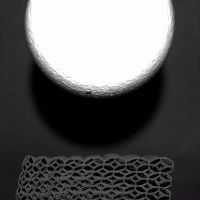

<h1>Spatially-Graded 3D-Printed Viscoelastic Truss Metamaterials for Impact Trajectory Control and Energy Absorption</h1>

  Kaoutar Radi1, Raphaël N. Glaesener1, Siddhant Kumar2, Dennis M. Kochmann1, 

  1 ETH Zurich, Switzerland  
  2 TU Delft, Netherlands

    

## Overview

This repository houses the data and resources needed to reproduce the figures from our paper.

## Simulations

- Simulations were performed using the finite element codes hosted on the mechanics and materials group GitLab. You can find the code at [ae108](https://gitlab.ethz.ch/mechanics-and-materials/).
- The results derived from these simulations, for each figure, are available in the `data` directory.

## Experiments

- Lattices for experiments were 3D printed using STL files. These files were generated from nodal coordinate and connectivity information.
- The Python script responsible for converting this mesh data into  STL files is located in the `src` directory, along with a mesh example.
- The raw experimental data is stored in the `data` directory of this repository.

## Inquiries and Assistance

Should you have general questions or need guidance on reproducing the simulations, please reach out to either the first author or the corresponding author.

